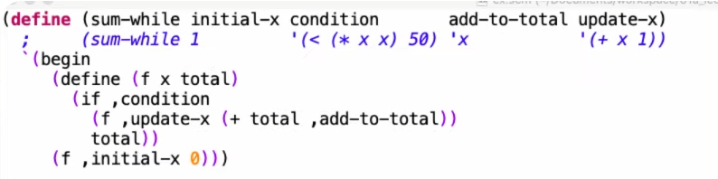

# CS61A-fall-2020-proj4-scheme-notes-and-code
### 速通 scheme 语法和特性

PS：仅含基本语法作为速通，详见[ 官方 Project reference: https://inst.eecs.berkeley.edu/~cs61a/fa20/articles/scheme-spec.html](https://inst.eecs.berkeley.edu/~cs61a/fa20/articles/scheme-spec.html)

---

#### Scheme expressions

1. <b>Primitive expressions</b> 原始表达式：2 3.3 true +
2. <b>Combinations</b> 组合：( 1 + 3 ) \* 2 在 scheme 中的表达式为：
   ```
   (* 2 (+ 1 3))
   ```
3. **Lambda expressions**(λ): (lambda (\<formal parameters>) \<body>) e.g.
   ```
   ((lambda (x y z) (+ x y (square z))) 1 2 3)
   ```
4. ';' 引出注释，intepreter 自动忽略。

#### Specail forms

1. <b>if</b> expression: (if \<condition>\<then-expression> \<else-expression>)
   ```
   (if (> x 10) (print 'big) (print 'small))
   ```
2. <b>and and or</b>: (and \<e1> ... \<en>), (or \<e1> ... \<en>)
3. **Binding symbols**: (define \<symbol> \<expression>) e.g.
   ```
   (define x 3)
   ```
4. **New procedures**: (define (\<symbol> \<formal parameters>) \<body>)
   ```
   (define  (square x) (* x x))
   >(square 3)
   9
   ```
5. **cond expressions**: (cond \<e1> \<e2> \<e3>) 类似于其他语言中的 if-else
   ```
   (cond ((> x 10) (print 'big))
         ((> x 5) (print 'medium))
         (else (print 'small)))
   ```
6. **begin expressions**: (begin \<e1> \<e2> \<e3>) 将多个表达式合成为一个表达式：
   ```
   (begin (print 'big) (print 'medium) (print 'small))
   ```
7. **let expressions**: (let \<bindings> \<body>)临时将值赋给符号，仅在\<body>中生效
   ```
   (define c (let (a 3)
                  (b 4))
                  (sqrt (+ (* a a) (* b b))))
   ```

#### list (内置链表)

1. **list**: 创建 list 一个链表
   ```
   (list 1 2 3)
   ```
2. **cons**: (cons \<expression> \<list>) 将 expression 插入到 list 头部，若\<list>不是 list 那么会自动创建一个 list
   
3. **length**: 返回 list 的长度
   ```
   (length (list 1 2 3))
   ```
4. **car**: 返回 list 的第一个元素
   ```
   (car (list 1 2 3))
   ```
5. **cdr**: 返回 list 剩下元素组成的 list
   ```
   >(cdr (list 1 2 3 4))
   (2 3 4)
   ```
6. **nil**: an empty list
7. **null**: 返回 list 是否为空
   ```
   >(null (list 1 2 3))
   #f
   >(null nil)
   #t
   ```
8. **append**: 将 list 合并为一个 list
   ```
   >(append (list 1 2) (list 3 4))
   (1 2 3 4)
   ```

---

### Scheme 一个重要的 feature——quote

1. 思考一下 c/c++中的 a 和'a'的区别
2. scheme expression 本质上是一个 list，如何确定我们要的是表达式本身（一个 list）还是这个表达式经过 evaluate 得到的 expressiion，请看：

   ```
   >(define a 1)

   >(list a 2)
   (1 2)

   >(list 'a 2)
   (a 2)

   >(/ 4 2)
   2

   >'(/ 4 2)
   (/ 4 2)

   >(eval '(/ 4 2))   ;eval-->evaluate
   2
   ```

3. (quote \<expression>) <==>'\<expression>，后续解释器中 reader 将会把简化表达式（后者）转化为标准表达式（前者）
4. **unquote**: 操作符: '`' ','
   ```
   define
   >`(a ,(+ b 1))  ; 必须使用 ` ，而不是 '
   (a 5)
   >'(a ,(+ b 1))
   (a (unquote (+ b 1)))
   ```
5. Why Scheme? quote 和 unquote 结合起来，就为 generate code 提供了可能：这个例子中，只需要将求和的条件、想要求和的变量 f(x)，求和的间隔等参数 quote 起来作为 list 传入就可以获得不同的函数！这就是 Scheme 的魅力！

   ```
   > (sum-while 0 '(< x 4) 'x '(+ x 1))
   (begin (define (func x total) (if (< x 4) (func (+ x 1) (+ total x)) total)) (func 0 0))
   ; sum-while返回的只是一个由begin合成的表达式，并非最终值

   > (eval (sum-while 0 '(< x 4) 'x '(+ x 1)))
   6
   ; evaluate上述表达式的值得到6！(1+2+3)
   ```

6. 这个代码的例子来自于 cs61a lect 课件，贴在这里方便大家参考并自行更改探索。[官方 online intepreter：https://code.cs61a.org/](https://code.cs61a.org/)
   ```
   (define (sum-while initial-x condition add-to-total update-x)
    `(begin
    (define (func x total)
    (if ,condition
        (func ,update-x (+ total ,add-to-total))
        total))
    (func ,initial-x 0)))
   ```
7. 最后推荐大家在 vscode 上随便下一个 scheme 代码功能插件（代码高亮、变量名补全），写完以后在 copy 到 online intepreter 上调试。

---

### 动手写 Intepreter！

#### Reader

1. lexical analyse : 按词意分割输入字符串为多个'token'(s)，一个整体的 symbol 不会被分为多个基本字符，一个多位数字也不会被分为多个个位数
   ```
   e.g.
   >(define hello 23)
   ['(','define','hello','23',')']
   ```
2. Parse : 将 tokens 组织成写解释器的语言容易处理的结构，scheme 语法中，括号已经很好地组织了操作符、操作对象。于是我们就**根据括号**将 tokens 组织成 Scheme list 的形式，在 python 中用 class Pair 来储存。
   ```
   e.g.
   >(1 2 3)
   Pair(1, Pair(2, Pair(3, nil)))
   >((+ 1 2) (* 3 4))
   Pair(Pair('+', Pair(1, Pair(2, nil))), Pair(Pair('*', Pair(3, Pair(4, nil))), nil))
   ```
   可能遇到的问题：
   - Problem1 只需要考虑简单的 scheme list 例如(1,2,3)，复合的 expr 将在 scheme_eval 中实现。
   - **debug 的时候，可以用 repl_str()函数获得 Pair 的字符串形式。**
3. Shorthand:
   - Quote：在 Problem6 中实现。这个比较绕，尤其是 unlock 可能需要想一会儿（想不出来可以合理借助 online intepreter）
     实际上，(quote \<expression>) 在被 read 时，相当于多给原表达式套了一层 Pair，只要想清楚其结构后面 Problem6 引刃而解。
     ```
     e.g.
     ><Whatever-expression>
     Pair(..., nil)
     >'<Whatever-expression>
     Pair(quote, Pair(Pair(..., nil), nil))
     ```
     注意，quote 和(1 2)并列，而非和 1 2 并列，所以 read 的结果不是 Pair(quote, Pair(..., nil), nil)
   - User-define function:
4. Lambda: 2020 fall 的第二个 unlock 有点恶心，在 2021 fall 已做修改。（看来 UCB 的学生也遇到了困难，btw 非常羡慕 cs61a 课程组能如此迅速根据学生反馈修改课程）
   ```
   Pair(Pair('+', Pair('a', Pair(Pair('*', Pair('b', Pair('c', nil))), nil))), nil)
   ```

#### Evaluate(eval)

1. **scheme_eval**:一个递归函数，整个 intepreter 的灵魂，识别 reader 读到的 expression，根据其不同的嵌套形式（Pair 是如何组织的）、operator 进行不同的处理：
   - basic case1：expr 是 self-evaluating 的（不知道咋翻译），大概就是：evaluate 的值就是本身。
   - basic case2：expr 是变量名，那就在当前环境（class Frame）中 lookup 其对应的值。（可能是一个 self-evaluating 的值，如 int，float，nil；也可能是一个 procedure，也就是一个函数）
   - Special form：当 operator 是 special form 的 keyword 时，调用一系列 do\_???\_form 函数来处理。（也就是我们在 Scheme project p12-14 所实现的部分）
   - call expression：需要执行，获得 expr 对应值来代替其原有位置的表达式。感觉说的不太清楚，举几个例子：
     ```
     >(+ 1 2)
     3    ;假设(+ 1 2)是表达式中的一部分，那么将需要用3直接替代原有位置
     >(define (square x)(* x x))
     square
     >(define y (square 5))
     y    ;实际上是(define y 25)，(square 5)就是一个call expression
     >y
     25
     ```
2. **scheme_apply**直接在 scheme_eval 中处理 call expression 固然可行，但是这样代码的逻辑性将会有所降低。故 define 一个新的函数 scheme_apply 专门 handle call expression：当 evaluate 时遇到 call expression 就调用 apply，当 apply 又需要调用 eval 以获得可以直接运算的值，例如，(+ 1 y)当然不可以直接 apply，必须先把 y 通过 eval 的 basic case 变成可以运算的值（int，nil，procedure···）才行。实际上，call expression 涵盖的范围非常广，从 builtin procedure 到 user-defined procedure，同样，调用不同 operator 对应的函数来 handle 不同 case。
3. 当我们写一个庞大的工程的时候，就需要现有一个宏观的设计，可以是数据结构（例如 scheme proj 中的 frame，Pair），主体函数（例如 scheme_read,scheme_eval），这样下来逻辑就会很清晰，至少不会找不到前进的方向。
4. 可能遇到的问题：
   - debug 时可以使用 repl_str()函数，将 Pair 还原成 read 之前的 str。如：
   ```
   >>>print(repl_str(Pair(+,Pair(1,Pair(2,nil)))))
   (+ 1 2)
   ```
   - problem 4 的 test case 并不全面，即使你能通过并不代表代码没有问题，如果后面的 problem 出现了意想不到的 bug，debug 很久也没有找到，试着找一找 scheme_eval()的问题。

#### Environment(Frame)

1. evaluate 中一个至关重要的步骤就是将名字和与它 bind 的 expression 对应，这需要在整个 proj 中进行维护。Proj 中使用 Class Frame 来实现，它和普通字典的区别仅在于可以找到 parent Frame：如果在 self.bindings 中找不到某个名字对应的 expr 那么就递归地在 parent frame 找。这个逻辑和 Python 如出一辙，CS61A 前面的课程也有具体讲到，此时又在 Schemem proj 里面进行了一次实践。
2. 需要创建 Frame 的情况：
   - 每次执行 procedure 时，都需要创建一个 Frame 的实例 env，以这个 procedure 被 evaluated 的 env 作为 Parent Frame。
   - let form：很好理解，let 通过创建 child frame 的方式将变量和 expr 临时 bind 起来，这显然不会改变 parent frame 中存在的 bindingds。所以是临时的。
3. 可能遇到的问题：
   - problem 11，实现的 make_call_frame()是 procedure 类的方法，显然要以这个 procedure 的 env 作为 parent frame，那么第三个参数'env'就是多余的，放在这里实际上是为 problem18 做铺垫。这里直接用 self.env 即可。
   - 为了更舒适地进行ok测试，你可能需要
   ```
   python ok -v -q 10 --local
   ```
   这样可以本地运行所有测试样例（遇到Error不会停+不会出现提交提示，还要多按一个ctrl+c，烦死了）
#### Write some scheme：

1. 推荐大家在 vscode 上随便下一个 scheme 代码功能插件（代码高亮、变量名补全），写完以后在 copy 到 online intepreter 上调试。[官方 online intepreter：https://code.cs61a.org/](https://code.cs61a.org/)
2. Problem15 在 online intepreter 可以正确输出，local 不行，可能是因为 builtin 的 cons 函数有误，原因是：当第二个 argument 非 list 时，local intepreter 缺少将其先转化为 list 再插入元素的步骤，故需要在 return 之前加上以下代码：
   ```
   if scheme_numberp(y) or scheme_symbolp(y):
        return Pair(x, Pair(y,nil))
   ```
